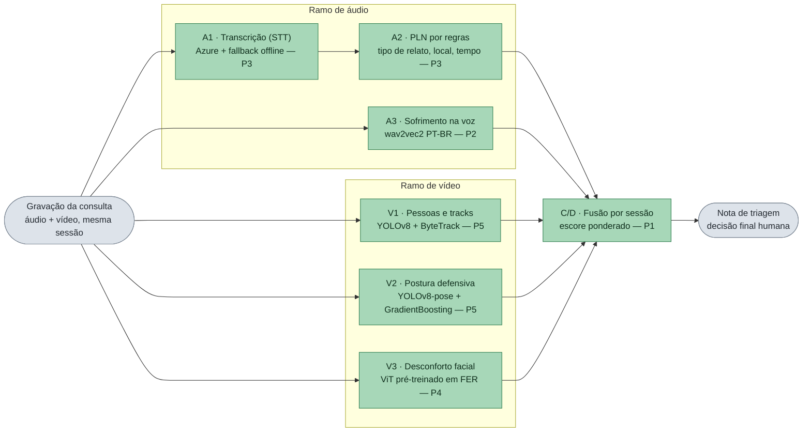

# Tech Challenge 4 — Triagem Multimodal em Consultas (Saúde da Mulher)

Pipeline de apoio à triagem: a **gravação da consulta** (presencial ou teleconsulta, PT-BR) alimenta áudio (relato + sofrimento na voz) e vídeo (desconforto facial, postura defensiva, presença de acompanhante). Por virem da mesma sessão, a fusão gera um **alerta de triagem à equipe especializada** — **decisão final humana**.

Fonte da verdade: `AGENTS.md` + `specs/002-triagem-consulta/`.

## O que é esse projeto?

A gravação de uma consulta (presencial ou teleconsulta) alimenta dois ramos — áudio e vídeo — que,
por virem da **mesma sessão**, são fundidos por `session_id` e geram uma **nota de triagem** para a
equipe especializada. A decisão final é sempre humana.



Convenção de nomes: **A\*** = módulos de áudio, **V\*** = módulos de vídeo, **C/D** = correlação e
decisão (a fusão). Cada módulo devolve um número entre 0 e 1 (ou um JSON pequeno), e a fusão os
combina numa única nota. **Os seis módulos rodam reais** — os stubs continuam como rede de
segurança, acionados por `src/resolve.py` quando falta pacote, artefato treinado ou credencial.

Glossário rápido: **STT** (*speech-to-text*) é a transcrição automática da fala; **PLN** é o
processamento de linguagem natural que extrai campos estruturados do texto; **FER** (*facial
expression recognition*) é reconhecimento de expressão facial; **YOLOv8** detecta pessoas em vídeo e
**ByteTrack** as segue quadro a quadro, dando um ID estável a cada uma.

Os contratos JSON de cada módulo estão em `src/contracts/` e são **imutáveis a partir da Etapa 2** —
é o que permite cada P trabalhar em paralelo sem quebrar o vizinho.

## Instalação (reproduzível)

Requer [uv](https://docs.astral.sh/uv/) e Python 3.11+.

```bash
uv sync
cp .env.example .env   # preencha AZURE_SPEECH_KEY / AZURE_SPEECH_REGION (P3)
```

## Pipeline ponta a ponta

O que queremos mostrar: **do áudio e do vídeo de uma consulta até o alerta de triagem**, sem passos manuais no meio. Um único programa (`src.run_event` — o “runner”) recebe os dois arquivos, passa pelos módulos de áudio e de vídeo e imprime a nota de triagem.

Para provar que o fluxo inteiro sobe num clone limpo — mesmo sem gravação real de consulta — use arquivos-fantoche:

```bash
uv run python -m src.run_event --audio dummy.wav --video dummy.mp4 --make-dummies
```

`dummy.wav` e `dummy.mp4` não são consultas de verdade: com `--make-dummies`, o runner cria sozinho ~2 s de **silêncio** (áudio) e um **vídeo preto** (uma tela vazia). Serve só para exercitar o caminho ponta a ponta. Com gravação real, troque os caminhos pelos seus `.wav` / `.mp4`.

No início a saída lista o mapa `[resolve]` (qual módulo rodou de verdade e qual usou stub, e por quê); no fim, o tempo de cada módulo em ms.

Testes automatizados:

```bash
uv run pytest
```

### Módulos reais vs stubs (`src/resolve.py`)

Nenhum caminho do pipeline importa `src.stubs.*` direto: `get_module(name)` tenta o módulo real
(`src/audio|video/<nome>/infer.py`) e cai para o stub — **sempre com log do motivo** — quando falta
pacote, artefato treinado, credencial, ou quando o `infer.py` real ainda é só um re-export do stub.

| Variável | Efeito |
|---|---|
| `TC4_FORCE_STUBS=1` | força 100% stub (demo controlada, reprodutível) |
| `TC4_REQUIRE_REAL=v1_tracks,v2_pose` | erro se algum listado cair para stub (CI futura) |

### Modelos treinados (`models/`)

`models/v2_posture_head.pkl` (~700 KB, cabeça de postura do V2) **é versionado** para o V2 real
funcionar num clone limpo; `models/v2_posture_metrics.json` guarda o F1 do treino. Demais pesos
(`*.pt`, `*.bin`, checkpoints) continuam fora do git. Reprodutibilidade — o `.pkl` sai de:

```bash
uv run python scripts/extract_pose_frames.py --raw-dir data/video_consulta/raw/ravdess  # atores 01–08
uv run python scripts/train_v2_posture.py    # seed 42, split por ator → F1 macro 0,6868
```

`models/a3_emotion/` (wav2vec2 do A3, ~1,2 GB) **não é versionado** — fica num repositório
privado no Hugging Face. As métricas ficam no git como evidência
(`models/a3_emotion_metrics.json`, `models/a3_threshold_metrics.json`):

O repo é `fiap-ssp-2025/tc4-a3-sofrimento-voz`, privado sob a organização do time — é
preciso ser membro (papel `read` basta; peça ao P2).

```bash
uv run hf auth login
uv run python scripts/download_a3_model.py       # → models/a3_emotion/
```

Sem esse download o A3 cai para stub. Reprodução do zero: `scripts/train_a3_emotion.py`
(~4 h em CPU) seguido de `scripts/eval_a3_threshold.py`, que calibra o limiar na validação.

`models/v3_face/` (ViT do V3, ~343 MB) segue o mesmo arranjo — pesos no Hugging Face
(`fiap-ssp-2025/tc4-v3-desconforto-facial`), métricas versionadas em
`models/v3_face_metrics.json` e `models/v3_clip_metrics.json`:

```bash
uv run python scripts/download_v3_model.py       # → models/v3_face/
```

O diretório é auto-contido (`config.json` + `model.safetensors` + `preprocess.json`): carrega
**offline**, sem baixar o backbone. O `preprocess.json` viaja junto porque o V3 pontua recortes
de rosto — mudar recorte ou normalização sem mudar o peso degrada o modelo em silêncio.
Reprodução do zero (GPU, ~40 min): `scripts/t112/run_t112_r3.sh` e depois
`scripts/t112/export_v3_model.py`.

Os pesos YOLO (`yolov8n.pt`, `yolov8n-pose.pt`) são baixados pela ultralytics no primeiro uso.
Sem eles (ou sem o `.pkl`), os testes de V1/V2 reais são pulados e o pipeline usa os stubs.

Eventos sintéticos de fusão:

```bash
uv run python -m src.fusion.generate_synthetic
# → data/fusion_synthetic/events.jsonl
```

## Situação dos módulos

**Os seis módulos rodam reais.** Os stubs continuam existindo como rede de segurança: sem o
pacote, o artefato treinado ou a credencial, `src/resolve.py` cai para eles e loga o motivo.

| Papel | Módulo | Precisa de |
|-------|--------|-----------|
| **P2** | `src/audio/a3_emotion/` (T110) | `models/a3_emotion/` (download) |
| **P3** | `src/audio/a1_stt/`, `src/audio/a2_nlp/` (T111) | nada — o A1 tem fallback offline |
| **P4** | `src/video/v3_face/` (T112) | `models/v3_face/` (download) |
| **P5** | `src/video/v1_tracks/`, `src/video/v2_pose/` (T113) | pesos YOLO + `.pkl` versionado |
| **P1** | `src/fusion/`, `src/resolve.py`, `src/run_event.py`, contratos | — |

Contratos JSON em `src/contracts/` — **imutáveis a partir da Etapa 2**.

## Estrutura

```text
src/
  contracts/     # A1/A2, A3, V1, V2, V3, C/D
  audio/         # a1_stt, a2_nlp, a3_emotion
  video/         # v1_tracks, v2_pose, v3_face
  fusion/        # correlate, scoring, report
  stubs/         # infer() fixos até modelos reais
  resolve.py     # escolhe real vs stub por módulo (com log)
  run_event.py
models/          # v2_posture_head.pkl (versionado); demais pesos fora do git
data/
  audio_ptbr/ video_consulta/ pose_posture/ fusion_synthetic/
specs/002-triagem-consulta/
```

## Spec-Driven Development

Fluxo: `constitution → specify → clarify → plan → tasks → implement`.

Feature ativa: **002-triagem-consulta** (`in-progress`). A `001-despacho-audio-video` ficou `superseded` (reancoragem hospitalar). O exemplo `hello_sdd` / `specs/000-hello-sdd` permanece até a Etapa 5.

```bash
uv run hello-sdd Ada   # exemplo legado
```
