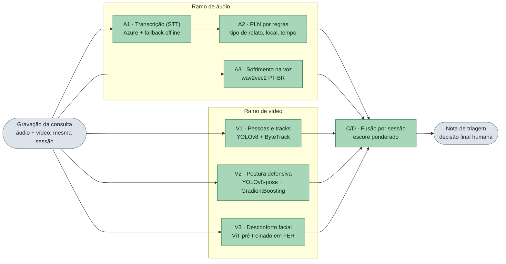

# Tech Challenge 4 — Triagem Multimodal em Consultas (Saúde da Mulher)

Fonte da verdade: `AGENTS.md` + `specs/002-triagem-consulta/`.

**Relatório técnico:** [`docs/relatorio-tecnico.md`](docs/relatorio-tecnico.md)
**Vídeo de demonstração:** `[INSERIR LINK DO YOUTUBE — não listado]`

## 1. O Projeto

A gravação de uma consulta (presencial ou teleconsulta, PT-BR) alimenta dois ramos — áudio e
vídeo — que, por virem da **mesma sessão**, são fundidos por `session_id` e geram uma **nota de
triagem** para a equipe especializada. A decisão final é sempre humana.



| Prefixo | Significado |
|---------|-------------|
| **A\*** | módulo do ramo de áudio (A1, A2, A3) |
| **V\*** | módulo do ramo de vídeo (V1, V2, V3) |
| **C/D** | correlação e decisão — a fusão dos sinais |

Cada módulo devolve um número entre 0 e 1 (ou um JSON pequeno), e a fusão os combina numa única
nota. **Os seis módulos rodam reais** — os stubs continuam como rede de segurança, acionados por
`src/resolve.py` quando falta pacote, artefato treinado ou credencial.

No diagrama: STT¹, PLN², FER³, YOLOv8⁴ e ByteTrack⁵.

Os contratos JSON de cada módulo estão em `src/contracts/` e são **imutáveis a partir da Etapa 2** —
é o que permite o trabalho em paralelo sem quebrar o vizinho.

---

¹ **STT** (*speech-to-text*) — transcrição automática da fala em texto.  
² **PLN** — processamento de linguagem natural; aqui, extrai campos estruturados do texto (tipo de relato, local, tempo).  
³ **FER** (*facial expression recognition*) — reconhecimento de expressão facial.  
⁴ **YOLOv8** — detector que localiza pessoas (e poses) em cada quadro do vídeo.  
⁵ **ByteTrack** — acompanha cada pessoa quadro a quadro e mantém um ID estável.

## 2. Estrutura

```text
src/
  contracts/     # A1/A2, A3, V1, V2, V3, C/D
  audio/         # a1_stt, a2_nlp, a3_emotion
  video/         # v1_tracks, v2_pose, v3_face
  fusion/        # correlate, scoring, report
  stubs/         # infer() fixos até modelos reais
  resolve.py     # escolhe real vs stub por módulo (com log)
  run_event.py
models/          # v2_posture_head.pkl (versionado); demais pesos fora do git
data/
  audio_ptbr/ video_consulta/ pose_posture/ fusion_synthetic/
specs/002-triagem-consulta/
```

### 2.1 Spec-Driven Development

A fonte da verdade deste repositório é a especificação em `specs/`, não o chat. Fluxo:

```text
constitution → specify → clarify → plan → tasks → implement
```

Features: **002-triagem-consulta** (produto) e **003-melhorias-triagem** (separação de locutores e
calibração de escala). A `001-despacho-audio-video` ficou `superseded` — reancoragem ao contexto
hospitalar, mantida como registro de decisão.

Decisão de go/no-go da Etapa 3: `docs/go-no-go-etapa3.md`.

Instruções para agentes: `AGENTS.md`.

## 3. Instalação

Requer [uv](https://docs.astral.sh/uv/) e Python 3.11+.

```bash
uv sync
cp .env.example .env   # preencha AZURE_SPEECH_KEY / AZURE_SPEECH_REGION
```

## 4. Módulos e modelos

**Os seis módulos rodam reais.** Os stubs existem como rede de segurança: sem o pacote, o artefato
treinado ou a credencial, `src/resolve.py` cai para eles e loga o motivo. Nenhum caminho importa
`src.stubs.*` direto.

| Módulo | Função | Algoritmo / arquitetura | Origem | Tamanho | Onde fica |
|--------|--------|-------------------------|--------|---------|-----------|
| **A1** | Transcrição (STT) | Azure Speech; fallback **faster-whisper** (offline) | nuvem Azure + pacote local | — | credencial no `.env`; whisper no cache do pacote |
| **A2** | PLN por regras | regras determinísticas (sem ML) | código do repositório | — | `src/audio/a2_nlp/` |
| **A3** | Sofrimento na voz | **wav2vec2-large-xlsr-53** fine-tuned em PT-BR (`jonatasgrosman/…`) — encoder de fala, não é LLM | Hugging Face `fiap-ssp-2025/tc4-a3-sofrimento-voz` (privado) | ~1,2 GB | `models/a3_emotion/` (download) |
| **V1** | Pessoas e tracks | **YOLOv8n** + **ByteTrack** (CNN ultralytics) | ultralytics, no primeiro uso | ~6 MB | cache local (`yolov8n.pt`) |
| **V2** | Postura defensiva | **YOLOv8n-pose** + **Gradient Boosting** (scikit-learn) sobre keypoints — ML clássico, não é LLM | YOLO: ultralytics; cabeça: treino local (RAVDESS) | ~12 MB + ~700 KB | cache (`yolov8n-pose.pt`) + `models/v2_posture_head.pkl` **(no git)** |
| **V3** | Desconforto facial | **ViT-base** fine-tuned a partir de `trpakov/vit-face-expression` — vision transformer, não é LLM | Hugging Face `fiap-ssp-2025/tc4-v3-desconforto-facial` (privado) | ~343 MB | `models/v3_face/` (download) |
| **C/D** | Fusão por sessão | regras + escore ponderado (sem ML) | código do repositório | — | `src/fusion/` |

Métricas de treino ficam no git (`models/*_metrics.json`). Demais pesos (`*.pt`, `*.bin`,
checkpoints) ficam fora do repositório.

Variáveis úteis: `TC4_FORCE_STUBS=1` força 100% stub; `TC4_REQUIRE_REAL=v1_tracks,v2_pose`
erra se algum listado cair para stub.

**Baixar A3 e V3** (membro da org no Hugging Face com papel `read`):

```bash
uv run hf auth login
uv run python scripts/download_a3_model.py       # → models/a3_emotion/
uv run python scripts/download_v3_model.py       # → models/v3_face/
```

Sem esses downloads, A3/V3 caem para stub. O V3 é auto-contido (`config.json` +
`model.safetensors` + `preprocess.json`) e carrega **offline**.

**Reproduzir do zero** (opcional):

```bash
# V2 — seed 42, split por ator → F1 macro 0,6868
uv run python scripts/extract_pose_frames.py --raw-dir data/video_consulta/raw/ravdess
uv run python scripts/train_v2_posture.py

# A3 — ~4 h em CPU; depois calibra o limiar na validação
uv run python scripts/train_a3_emotion.py
uv run python scripts/eval_a3_threshold.py

# V3 — GPU, ~40 min (varredura fatorial 2x2; ver docs/relatorio-tecnico.md §5.6)
uv run python scripts/t112/train_t112_fer.py --data-root data/video_consulta --out results --sweep v3
uv run python scripts/t112/eval_t112_clip.py --ckpt results/v3_fer_best.pt --data-root data/video_consulta
```

Eventos sintéticos de fusão:

```bash
uv run python -m src.fusion.generate_synthetic
# → data/fusion_synthetic/events.jsonl
```

## 5. Pipeline ponta a ponta

O que queremos mostrar: **do áudio e do vídeo de uma consulta até o alerta de triagem**, sem
passos manuais no meio. Um único programa (`src.run_event` — o “runner”) recebe os dois arquivos,
passa pelos módulos de áudio e de vídeo e imprime a nota de triagem.

Para provar que o fluxo inteiro sobe num clone limpo — mesmo sem gravação real de consulta — use
arquivos-fantoche:

```bash
uv run python -m src.run_event --audio dummy.wav --video dummy.mp4 --make-dummies
```

`dummy.wav` e `dummy.mp4` não são consultas de verdade: com `--make-dummies`, o runner cria
sozinho ~2 s de **silêncio** (áudio) e um **vídeo preto** (uma tela vazia). Serve só para
exercitar o caminho ponta a ponta. Com gravação real, troque os caminhos pelos seus `.wav` /
`.mp4`.

No início a saída lista o mapa `[resolve]` (qual módulo rodou de verdade e qual usou stub, e por
quê); no fim, o tempo de cada módulo em ms.

Testes automatizados:

```bash
uv run pytest
```
