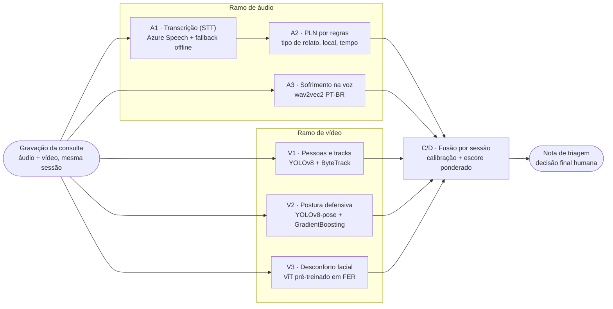

# Relatório Técnico — Tech Challenge 4

## Triagem Multimodal em Consultas: Saúde da Mulher

**Grupo:** Marcelo Arruda de Siqueira · Leonardo Barbosa Nogueira · Jose Flavio Neto · Pedro Matias dos Santos · Wellington Oliveira de Andrade
**Data:** 28 de julho de 2026

**Repositório:** https://github.com/fiap-ssp-2025/tech-challenge-4
**Vídeo de demonstração:** `[INSERIR LINK DO YOUTUBE — vídeo não listado]`

---

## 1. Resumo executivo

Este trabalho apresenta um sistema de apoio à triagem que analisa a gravação de uma consulta de
saúde da mulher e produz uma nota indicativa de risco para a equipe especializada. A gravação
alimenta dois ramos de processamento, áudio e vídeo, cujas saídas provêm de cinco modelos
independentes e são combinadas em um escore único, conforme a Figura 1.



*Figura 1 — Visão geral do pipeline: da gravação da consulta à nota de triagem.*

A decisão final permanece humana em todos os casos. O sistema sinaliza; não diagnostica, não
classifica pessoas e não substitui julgamento clínico.

Na entrega, os seis módulos do pipeline operam com modelos treinados, de ponta a ponta, com 77
testes automatizados em execução bem-sucedida. As três metas de acurácia definidas no plano do
projeto foram atingidas.

| Módulo                  | Meta            | Resultado |
| ----------------------- | --------------- | --------- |
| A3 (sofrimento na voz)  | F1 macro ≥ 0,75 | 0,7896    |
| V3 (desconforto facial) | F1 macro ≥ 0,70 | 0,7108    |
| V2 (postura defensiva)  | reportar        | 0,6868    |

Além das métricas de conjunto de teste, o sistema foi validado em cinco gravações ponta a ponta,
entre elas o primeiro minuto de uma ocorrência real de violência doméstica registrada em telefonia,
na qual o módulo de voz produziu escore 0,479 — 2,8 vezes o limiar de decisão do modelo.

---

## 2. O problema

A violência doméstica raramente chega ao sistema de saúde como denúncia. Chega como cefaleia
persistente, insônia, dor difusa ou ansiedade. A mulher frequentemente não verbaliza o que ocorre,
seja por medo, por vergonha ou pela presença do agressor no ambiente da consulta.

O profissional de saúde dispõe de poucos minutos por atendimento e nem sempre de formação
específica para reconhecer os sinais.

A hipótese de trabalho é que sinais de sofrimento distribuídos em canais distintos (o conteúdo do
relato, a prosódia da fala, a expressão facial e a postura corporal) são individualmente fracos,
mas, quando combinados, podem elevar a atenção da equipe para casos que passariam despercebidos.

### Delimitação do escopo

O sistema não constitui diagnóstico nem prova. Não identifica pessoas nem atribui papéis aos
participantes da consulta. Não decide encaminhamento; apenas informa quem decide.

---

## 3. Arquitetura

### 3.1 Contratos definidos antes dos modelos

Antes da implementação de qualquer modelo, o grupo definiu o formato exato de saída de cada módulo
e o congelou. São contratos JSON validados em tempo de execução, implementados em `src/contracts/`.

| Módulo | Contrato                                                                                        |
| ------ | ----------------------------------------------------------------------------------------------- |
| A1/A2  | `{transcricao, tipo_relato ∈ {violencia_domestica, sofrimento_emocional, outro}, local, tempo}` |
| A3     | `{sofrimento: 0..1}`                                                                            |
| V1     | `{n_pessoas, tracks: [{id, n_frames, bbox_media}]}`                                             |
| V2     | `{postura_defensiva: 0..1}`                                                                     |
| V3     | `{desconforto_facial: 0..1}`                                                                    |
| C/D    | `{escore, corroborado, nota_ocorrencia}`                                                        |

### 3.2 Substitutos com degradação registrada

Cada módulo possui uma implementação substituta (*stub*) que devolve valor fixo no formato do
contrato. A camada `src/resolve.py` decide, a cada execução, entre o modelo treinado e o
substituto, registrando o motivo da escolha:

```
[resolve] a3_emotion  → stub  (artefato ausente: models/a3_emotion — rode scripts/download_a3_model.py)
```

Na entrega final, os seis módulos resolvem para as implementações treinadas.

---

## 4. Dados

| Ramo            | Fonte                | Volume                 | Divisão                                     |
| --------------- | -------------------- | ---------------------- | ------------------------------------------- |
| Áudio PT-BR     | CORAA SER v1         | 933 áudios, 8 kHz mono | 666 / 166 / 101, por locutor                |
| Vídeo (face)    | RAVDESS + CREMA-D    | 20.612 frames faciais  | 14.388 / 2.996 / 3.228, por ator (80/17/18) |
| Vídeo (postura) | RAVDESS              | 11.504 frames de corpo | por ator (8 atores)                         |
| Fusão           | Sintético por sessão | `events.jsonl`         | não aplicável                               |

A divisão dos conjuntos foi feita por pessoa em todos os casos: nenhum locutor ou ator aparece
simultaneamente em treino e teste. A ausência de vazamento é verificada automaticamente pelos scripts
`verify_audio_dataset.py` e `verify_face_dataset.py`.

---

## 5. Módulos

### 5.1 A1 — Transcrição

O módulo utiliza o Azure Speech como provedor primário (camada gratuita F0, região `brazilsouth`),
com o modelo faster-whisper em execução local como alternativa automática. O reconhecimento é
contínuo, em português brasileiro.

### 5.2 A2 — Processamento de linguagem natural por regras

O módulo extrai de forma determinística os campos `{tipo_relato, local, tempo}` a partir da
transcrição, utilizando 28 termos associados a violência física e ameaça, termos associados a
sofrimento emocional, tratamento de negação e padrões de reconhecimento de local e tempo.

A opção por regras, em vez de um classificador treinado, deve-se a duas razões. Não havia, ao
alcance do grupo, corpus rotulado de relato clínico em português brasileiro. Além disso, uma regra
é auditável: o profissional pode verificar qual termo produziu a classificação.

### 5.3 A3 — Sofrimento na voz

Foi realizado ajuste fino (*fine-tuning*) do modelo `wav2vec2-large-xlsr-53-portuguese` sobre o
CORAA, em tarefa binária (neutro contra não-neutro), por 8 épocas em CPU, com pesos de classe para
compensar o desbalanceamento de 3,9 para 1. Apenas os 4 blocos superiores do codificador
transformador e a camada de classificação foram treinados; o codificador convolucional permaneceu
congelado.

| Ponto de operação                  | F1 macro (teste) |
| ---------------------------------- | ---------------- |
| Limiar padrão 0,50                 | 0,7171           |
| Limiar 0,17 calibrado na validação | 0,7896           |

A área sob a curva ROC (AUC) foi de 0,9229 na validação e 0,8456 no teste.

**Definição do limiar de decisão.** Treinado sobre conjunto majoritariamente neutro, o modelo
atribui probabilidades baixas por padrão: a mediana dos áudios neutros no conjunto de teste é 0,022
e a dos não-neutros, 0,239. A varredura de todos os cortes possíveis no conjunto de validação
indicou 0,17 como o valor que maximiza o F1 macro.

**Agregação temporal.** Áudio mais longo que a janela de treino (6 s) é segmentado em janelas, e o
escore final corresponde ao valor máximo entre elas, não à média.

### 5.4 V1 — Detecção de pessoas e rastreamento

O módulo emprega YOLOv8n com o algoritmo de rastreamento ByteTrack. A saída informa a contagem de
pessoas no quadro e a trajetória de cada uma, o que subsidia a leitura de presença de acompanhante.

### 5.5 V2 — Postura defensiva

O YOLOv8n-pose extrai 17 pontos-chave corporais. Sobre eles, são calculadas 43 características
geométricas (ângulos articulares e distâncias normalizadas) que alimentam um classificador
GradientBoosting. O F1 macro obtido foi 0,6868, com divisão por ator e semente fixa em 42.

O critério de aceite estabelecido no plano era reportar o F1, não atingir um valor mínimo.

### 5.6 V3 — Desconforto facial

O ponto de partida foi o modelo `trpakov/vit-face-expression`, um Vision Transformer previamente
treinado em reconhecimento de expressão facial, reajustado para a tarefa binária desconforto contra
neutro.

| Unidade de avaliação       | F1 macro | AUC    |
| -------------------------- | -------- | ------ |
| Por frame                  | 0,7045   | 0,7811 |
| Por clipe (unidade de uso) | 0,7108   | 0,8076 |

**Escolha da unidade de avaliação.** O contrato do V3 recebe um vídeo e devolve um escore único.
Medir o desempenho quadro a quadro responde à pergunta "o modelo acertou este quadro?", enquanto a
questão pertinente é "o modelo acertou esta gravação?". A inferência calcula a média dos escores
dos quadros amostrados, e a métrica por clipe reflete exatamente essa agregação.

**Delineamento experimental.** Dois fatores foram testados simultaneamente: a substituição do
modelo de partida e a remoção do rótulo `calm` do conjunto. Para isolar o efeito de cada um, o
experimento foi conduzido como delineamento fatorial 2 × 2, com quatro treinos cruzados, todos
avaliados nos dois conjuntos de teste correspondentes. Os resultados indicam que:

- a substituição do modelo de partida produziu o ganho observado. Partir de uma rede previamente
  treinada em expressões faciais, em lugar de uma treinada em objetos genéricos, elevou o AUC de
  0,7605 para 0,8076;
- a remoção do rótulo `calm` degradou o desempenho de forma consistente nas duas arquiteturas. Os
  1.152 quadros correspondentes funcionam como exemplos negativos úteis, pois delimitam que um
  rosto relaxado não configura desconforto.

### 5.7 C/D — Fusão

O escore de triagem é a soma ponderada dos sinais calibrados.

| Sinal                   | Peso |
| ----------------------- | ---- |
| Relato (A2)             | 0,28 |
| Sofrimento na voz (A3)  | 0,28 |
| Desconforto facial (V3) | 0,22 |
| Postura defensiva (V2)  | 0,22 |

**Calibração de escala.** Cada modelo possui fronteira de decisão própria, obtida na validação: o
A3 decide em 0,17 e o V3 em 0,70. Somá-los como se ambos decidissem em 0,50 subestima
sistematicamente o primeiro e superestima o segundo. Antes da soma, portanto, cada escore é
recolocado em uma escala na qual 0,5 corresponde à fronteira daquele modelo específico.

**Exclusão do termo de corroboração.** A formulação inicial atribuía peso ao indicador "áudio e
vídeo provêm da mesma sessão". Como, nesta arquitetura, essa condição é verdadeira por construção,
o termo comportava-se como constante somada a todos os casos. O indicador permanece na nota como
informação de proveniência, mas foi removido do cálculo.

---

## 6. Reprodutibilidade

```bash
uv sync
cp .env.example .env                              # AZURE_SPEECH_KEY / AZURE_SPEECH_REGION
uv run python scripts/download_a3_model.py        # pesos do A3 (Hugging Face)
uv run python scripts/download_v3_model.py        # pesos do V3
uv run python -m src.run_event --audio consulta.wav --video consulta.mp4 --session s1
```

Pesos com mais de 5 MB não são versionados no repositório; permanecem em repositórios privados da
organização no Hugging Face, com script de download idempotente. As métricas de cada modelo, essas
sim, são versionadas como evidência.

O projeto conta com 77 testes automatizados.

O tempo de inferência medido em consulta de 2 min 28 s foi: A1, 71 s; A3, 82 s; V1, 73 s; V2, 2,4 s;
V3, 1,5 s.

---

## 7. Resultados ponta a ponta

Foram avaliadas cinco gravações, cobrindo material sintético, atuado e real. As quatro primeiras
possuem áudio e vídeo; a última é uma ligação telefônica e exercita apenas o ramo de áudio. Os
travessões indicam módulos sem entrada disponível, não módulos com falha. Os valores de voz e face
são as saídas brutas dos modelos; o escore final incorpora a calibração da Seção 5.7.

| Caso                        | Origem                        | Relato (A2)            | Voz (A3) | Face (V3) | Postura (V2) | Escore |
| --------------------------- | ----------------------------- | ---------------------- | -------- | --------- | ------------ | ------ |
| Consulta A                  | gerada por IA                 | `violencia_domestica`  | 0,02     | 0,95      | 0,64         | 0,64   |
| Denúncia                    | gerada por IA                 | `sofrimento_emocional` | 0,02     | 0,99      | 0,57         | 0,52   |
| Consulta simulada           | atuada                        | `violencia_domestica`  | 0,04     | 1,00      | 0,08         | 0,53   |
| Consulta B (áudio sintético)| gerada por IA                 | `violencia_domestica`  | 0,02     | 0,94      | 0,67         | 0,645  |
| Consulta B (áudio humano)   | vídeo gerado + voz gravada    | `violencia_domestica`  | 0,06     | 0,94      | 0,67         | 0,676  |
| Ocorrência real             | ligação real                  | `outro`                | 0,479    | —         | —            | —      |

O módulo A2 classificou corretamente como `violencia_domestica` e extraiu contexto (`em casa`) e
tempo (`semana passada`) em todos os casos de consulta, incluindo o de áudio humano, no qual a
transcrição apresentou pequenas imprecisões decorrentes da fala emocionada.

### 7.1 Validação do módulo de voz

Além do conjunto de teste, o A3 foi aplicado ao primeiro minuto de uma ocorrência real de violência
doméstica (gravação telefônica, 8 kHz, codec GSM), produzindo escore 0,479. A tabela situa esse
valor na distribuição do próprio modelo; os percentis provêm do conjunto de teste do CORAA,
versionado em `models/a3_reference_scores.json`.

| Referência                        | Escore |
| --------------------------------- | ------ |
| Mediana dos áudios neutros        | 0,022  |
| Percentil 90 dos áudios neutros   | 0,096  |
| Limiar de decisão do modelo       | 0,17   |
| Mediana dos áudios com sofrimento | 0,239  |
| Ocorrência real (este teste)      | 0,479  |
| Percentil 90 dos com sofrimento   | 0,678  |

O valor corresponde a 2,8 vezes o limiar de decisão e supera a mediana da própria classe positiva,
situando-se acima de 97,4% dos áudios neutros de referência. O perfil temporal é episódico: das dez
janelas de 6 s analisadas, três ultrapassaram o limiar, o que sustenta a decisão de agregar por
valor máximo (Seção 5.3).

As duas variantes da Consulta B, que compartilham vídeo e roteiro e diferem apenas na origem do
áudio, permitem isolar o efeito da natureza da voz: o valor máximo por janela passou de 0,048 com
voz sintética para 0,144 com voz humana gravada. A Seção 9 discute a implicação.

---

## 8. Declarações

### 8.1 Rótulo derivado por proxy

Os módulos V2 e V3 foram treinados com emoção atuada (RAVDESS e CREMA-D) como aproximação do
fenômeno de interesse. O V2 adota a correspondência `fearful`/`sad` para postura defensiva; o V3, a
mesma correspondência para desconforto facial. Não houve anotação humana de postura ou de expressão
em consulta real.

O que os modelos medem é, portanto, expressão encenada de medo e tristeza como aproximação de
sofrimento clínico, e não sofrimento anotado por profissional de saúde.

### 8.2 Distinção entre dado atuado e consulta real

Os conjuntos de treino foram produzidos em estúdio, com atores, iluminação controlada,
enquadramento frontal aproximado e fala dirigida. Uma consulta real apresenta enquadramento aberto,
iluminação de consultório, ruído ambiente e participantes que não atuam. Parte do desempenho aqui
relatado não deve ser esperada nessas condições.

### 8.3 Consentimento e proteção de dados

O material de demonstração é simulado ou gerado, produzido para este trabalho ou obtido de fontes
de conscientização pública. O áudio de ocorrência real utilizado na validação da Seção 7 não é
redistribuído: permanece fora do repositório e fora do vídeo de entrega, sendo relatados apenas os
valores agregados que produziu.

Em uso real, o sistema exigiria consentimento informado, base legal específica sob a Lei Geral de
Proteção de Dados, política de retenção mínima e controle de acesso. Nenhum desses mecanismos está
implementado, e o projeto não deve ser tratado como pronto para operação.

### 8.4 Decisão humana

A saída do sistema é uma nota indicativa, e toda nota emitida contém a frase "Esta nota é
indicativo, não veredito — decisão humana". O sistema não aciona serviços, não notifica autoridades
e não registra ocorrências. A decisão cabe à equipe de saúde.

### 8.5 Natureza do escore

Após a calibração descrita na Seção 5.7, o escore constitui um índice de risco comparável entre
módulos. O valor 0,7 não significa "70% de probabilidade de haver violência". Significa que a
combinação de sinais situa-se acima do ponto a partir do qual os modelos sinalizariam.

---

## 9. Limitações e trabalho futuro

**Divulgação velada não é capturada.** O sistema foi testado com gravação na qual a vítima sinaliza
risco sem empregar nenhum dos termos que o módulo A2 reconhece, estratégia frequente entre pessoas
que não podem relatar abertamente. O sistema classificou o caso como `outro` e o escore resultante
foi baixo.

**Vocabulário incompleto.** A ameaça de morte não está coberta pelos termos implementados.

**Separação de locutores.** O mecanismo apresentou duas limitações distintas. Em áudio telefônico
comprimido, agrupou dois falantes em um único, provavelmente pela redução das diferenças de timbre
introduzida pelo codec. Em áudio de boa qualidade, a separação funciona, mas o reagrupamento dos
trechos por falante refaz as fronteiras das janelas de análise e pode descartar o trecho de maior
escore: na Consulta B com voz humana, o valor máximo do áudio integral era 0,144 e o pipeline
entregou 0,062 (Seção 7.2). A separação não é, portanto, monotônica em relação ao processamento do
áudio integral.

**Instabilidade de rastreamento em vídeo sintético.** Na Consulta B, o V1 registrou seis
identificadores de pessoa em uma cena com duas participantes. A inspeção dos rastros mostra três
com centenas de quadros e três fragmentos, padrão compatível com perda e recriação de identificador
causada por inconsistências de aparência entre quadros gerados. O campo `n_pessoas` não integra o
cálculo do escore, de modo que o resultado final não é afetado.

**Dimensão dos conjuntos de teste.** O conjunto do A3 possui 101 áudios, dos quais 23 positivos, e
o do V3, 669 clipes. As metas foram atingidas, não superadas com margem: a incerteza estimada é da
ordem de ±0,03 a ±0,10.

**Ausência de controle negativo no domínio.** Todas as gravações de validação correspondem a casos
com sofrimento. Sem casos neutros de consulta, não é possível estimar a taxa de falso positivo em
uso real.

**Aplicabilidade do V2 em consulta.** Treinado com imagens de corpo inteiro de atores em pé, o
módulo produziu escore 0,08 para paciente sentada, configuração ausente do conjunto de treino.

---

## 10. Conclusão

O trabalho entregou um pipeline multimodal funcional, reproduzível e coberto por testes, que
combina cinco modelos e produz uma nota de triagem. As três metas de acurácia definidas no plano
foram atingidas.

O sistema não está pronto para uso real, pelas razões expostas na Seção 8. Cumpre, no entanto, o
objetivo a que se propôs: demonstrar que sinais fracos e distribuídos em canais distintos, tratados
com rigor metodológico e com declaração explícita de limites, podem apoiar a atenção do profissional
de saúde sem substituí-la.

---

## Referências

### Conjuntos de dados

CORAA SER v1. *Speech Emotion Recognition corpus para português brasileiro*. Disponível em:
https://github.com/rmarcacini/ser-coraa-pt-br.

LIVINGSTONE, S. R.; RUSSO, F. A. The Ryerson Audio-Visual Database of Emotional Speech and Song
(RAVDESS). *PLoS ONE*, v. 13, n. 5, e0196391, 2018. DOI: 10.1371/journal.pone.0196391.

CAO, H.; COOPER, D. G.; KEUTMANN, M. K.; GUR, R. C.; NENKOVA, A.; VERMA, R. CREMA-D: Crowd-sourced
Emotional Multimodal Actors Dataset. *IEEE Transactions on Affective Computing*, v. 5, n. 4,
p. 377-390, 2014. DOI: 10.1109/TAFFC.2014.2336244.

### Modelos e bibliotecas

BAEVSKI, A.; ZHOU, H.; MOHAMED, A.; AULI, M. wav2vec 2.0: A Framework for Self-Supervised Learning
of Speech Representations. *Advances in Neural Information Processing Systems*, v. 33, 2020.

DOSOVITSKIY, A. et al. An Image is Worth 16x16 Words: Transformers for Image Recognition at Scale.
*International Conference on Learning Representations*, 2021.

ZHANG, Y. et al. ByteTrack: Multi-Object Tracking by Associating Every Detection Box. *European
Conference on Computer Vision*, 2022.

Ultralytics YOLOv8. Disponível em: https://github.com/ultralytics/ultralytics.

Checkpoints utilizados: `jonatasgrosman/wav2vec2-large-xlsr-53-portuguese` (base do A3) e
`trpakov/vit-face-expression` (base do V3), ambos disponíveis no Hugging Face Hub.
